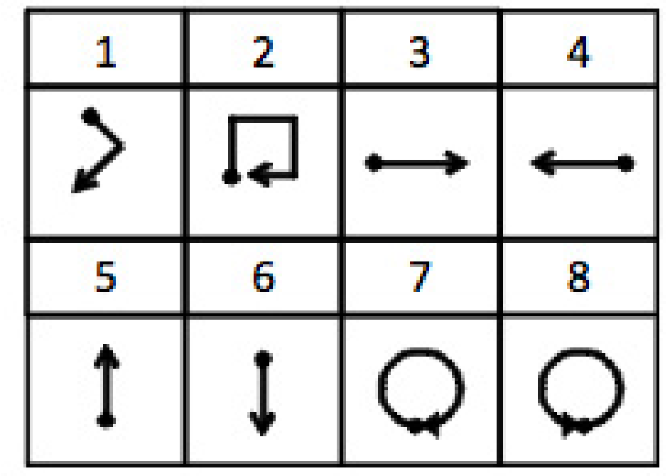

# UWave_gesture_recognition-

# Dataset Overview

I used the dataset from [uWave: Accelerometer-based personalized gesture recognition and its applications](https://www.yecl.org/publications/liu09percom.pdf) by Jiayang Liu et al. This dataset focuses on accelerometer-based personalized gesture recognition and consists of gesture samples recorded under controlled conditions.

### Dataset Details

- **Source**: [Dataset Link](https://www.yecl.org/publications/liu09percom.pdf)
- **Paper Reference**: Jiayang Liu et al., "uWave: Accelerometer-based personalized gesture recognition and its applications"

### Dataset Structure

Unpacking the dataset reveals several `.rar` files with the following organization:

1. **Naming Convention**:
   - Each `.rar` file corresponds to gesture samples collected from one user on a specific day.
   - Files are named as `U$userIndex($dayIndex).rar`, where:
     - `$userIndex`: Participant index (1 to 8)
     - `$dayIndex`: Day index (1 to 7)

2. **Contents of `.rar` Files**:
   - Each `.rar` file contains `.txt` files representing time-series acceleration data of gestures.
   - File naming convention: `[somePrefix]$gestureIndex-$repeatIndex.txt`, where:
     - `$gestureIndex`: Index of the gesture in the 8-gesture vocabulary
     - `$repeatIndex`: Repetition index of the same gesture pattern (1 to 10)

3. **Data Format in `.txt` Files**:
   - Each `.txt` file contains time-series data of acceleration values:
     - **Column 1**: x-axis acceleration
     - **Column 2**: y-axis acceleration
     - **Column 3**: z-axis acceleration
   - **Units**: Acceleration is measured in **G** (acceleration due to gravity).

### Gestures

The dataset includes 8 distinct gestures as shown in the reference material. In the gesture diagrams:
- **Dot**: Indicates the start of a gesture
- **Arrow**: Indicates the end of a gesture

Below is an example visualization of the gestures for reference.

For additional details, refer to the [paper](https://www.yecl.org/publications/liu09percom.pdf).
